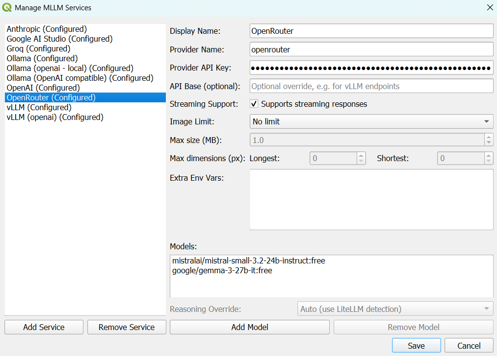
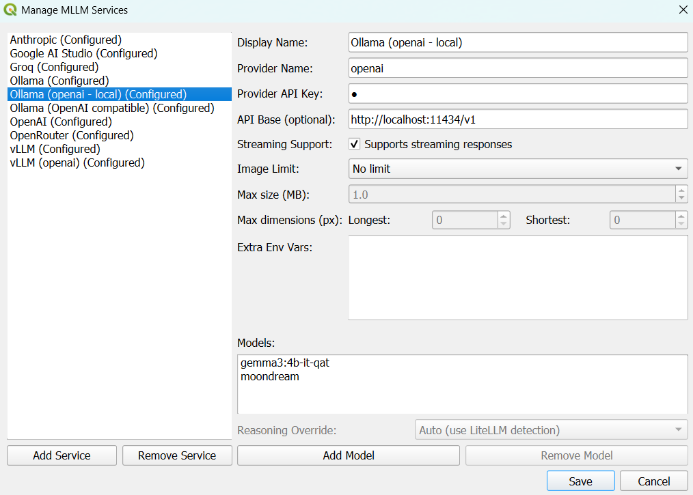

# LibreGeoLens

LibreGeoLens (LGL for short) is a QGIS plugin for experimenting with Multimodal Large Language Models (MLLMs)
to analyze remote sensing imagery.

## Demo

https://github.com/user-attachments/assets/3117c464-d049-4a6b-ae48-b22f37832121

## Key Features

- Chat with MLLMs about georeferenced imagery.
- Choose from 100s of different MLLM services and models, including custom OpenAI API compatible endpoints.
- Work with local and/or remote imagery.
- Draw areas to select and extract image chips to send to the MLLM.
- Keep track of the chips and the interactions with the MLLM as GeoJSON features.

## QGIS Installation

1. Navigate to the [QGIS Download Page](https://qgis.org/download/).
2. Use the Online (OSGeo4W) Installer: `Express Install` when prompted is fine.
3. Select https://download.osgeo.org when prompted for a download site.
4. When prompted with a checkbox list of four items to download, only QGIS (the first option) is necessary.
5. If you find QGIS font size too small (and thus LibreGeoLen's font size), you can configure it in `Settings` ->
`Options` -> `General` -> `Application` -> `Font` -> `Size`. You'll need to restart QGIS for the changes to take effect.

Note: In Windows, if you didn't install QGIS with admin rights, some of the features of this plugin may fail.
For example, you may not be able to stream COGs nor install the QMS plugin.
Even so, you should be able to work with local imagery. Here are some images you can download and test the plugin with:
- [Cincinnati](https://libre-geo-lens.s3.us-east-1.amazonaws.com/demo/imagery/COGS/NAIP/Ohio/Ohio_N/ortho_1-1_hn_s_oh061_2019_1.tif)
- [St Louis](https://libre-geo-lens.s3.us-east-1.amazonaws.com/demo/imagery/COGS/Missouri/Stl_County.tif)
- [Arizona](https://libre-geo-lens.s3.us-east-1.amazonaws.com/demo/imagery/COGS/NAIP/Arizona/Arizona_N/ortho_1-1_hn_s_az019_2019_1.tif)

## Quickstart

1. Go to `Plugins` > `Manage and Install Plugins...` -> `Settings` -> `Show also Experimental Plugins` -> `All` ->
   search for "LibreGeoLens", and click `Install Experimental Plugin`. Restart QGIS if needed.
2. Optionally load a basemap layer. See [this](https://www.giscourse.com/quickmapservices-plugin-an-easy-way-to-add-basemaps-in-qgis/) for an example of one way to do it. Google Road is a nice one to start with.
3. Click on the  icon on the top right to start
the plugin, which will be docked to your right. If you get an error about external Python dependencies, try restarting QGIS,
and if that does not solve the issue, you'll need to install them manually by following the
[Troubleshooting Python Dependencies](#troubleshooting-python-dependencies) section.
4. Configure an MLLM service as explained in the [MLLM Services](#mllm-services) section.
The quickest way is using one of the built-in presets (OpenAI, Anthropic, Google AI Studio or Groq)
for which you just need to supply an API key: just click on `Manage MLLM Services`,
select your service on the left, add your API key to `Provider API Key`, and hit `Save`.
5. Click on the `Load GeoJSON` button, choose `Use Demo Resources` and click `Ok`.
   1. If this fails, see the Note at the end of the [QGIS Installation](#qgis-installation) section above.
6. You will see three red polygons over the US. Zoom into one of them, click on the `Draw Area to Stream COGs` button,
   and draw an area that intersects with one of them (click once on the map to start drawing and a second time to finish). 
   The COG will be displayed.
   1. If you don't see the red polygons, right-click on the `Imagery Polygons` layer (usually on the bottom left of QGIS),
   and click on `Zoom to Layer(s)`.
7. Zoom into the image and find something you want to chat with the MLLM about.
8. Click on the `Draw Area to Chip Imagery` button, draw the area the same way you did before,
   and you'll see the chip above the `Send to MLLM` button.
9. Type a prompt and click on the `Send to MLLM` button to start a conversation.

## MLLM Services

LGL now routes all model traffic through [LiteLLM](https://docs.litellm.ai/), unlocking many MLLM services with a
single integration. The `Manage MLLM Services` button opens a configuration dialog where you can:

- Enable the built-in presets for OpenAI, Groq, Anthropic, and Google AI Studio by supplying API keys. Just select the
service on the left, add your API key to `Provider API Key`, and hit `Save`.
- Register any LiteLLM provider (MLLM service) with `Add Service` by entering the name to display in the LGL UI.
- Then you can configure it with its [provider name](https://docs.litellm.ai/docs/providers), API key
(can be fake if the service doesn't need one), optional API base (for OpenAI-compatible endpoints),
and whether streaming is supported.
  - For any MLLM service, `Provider Name` must match the LiteLLM Provider Route. For each LiteLLM provider,
it's usually explicitly mentioned in the provider page, and if not look for `completion(model="<provider_name>/...", ...)`.
Do not include the "/". The provider name should also be at the end of the LiteLLM provider page URL,
such as https://docs.litellm.ai/docs/providers/azure_ai (i.e, "azure_ai").
- Provide extra environment variables that should be passed as arguments to `litellm.completion`.
- Set optional image input limits per service (either maximum MB or maximum pixel dimensions)
to match each service expectations and avoid sending bigger images which will be downscaled regardless.
- Add or remove models for each service.
- Override LiteLLM's vision and reasoning detection for each model (not recommended, but sometimes it's needed).

Environment variables remain a valid fallback: if you leave an API key empty in `Manage MLLM Services`, LGL will look
for the expected system environment variables for the built-in presets
(`OPENAI_API_KEY`, `GROQ_API_KEY`, `ANTHROPIC_API_KEY`, `GEMINI_API_KEY`).
Configure them in QGIS via `Settings` -> `Options` -> `System` -> scroll down to `Environment`, toggle if needed,
enable `Use custom variables` if needed, and add the variables you need. Restart QGIS after changing environment
variables so the plugin receives the updated values.

### How to add a cloud-based MLLM service (e.g. OpenRouter)

1. Go to [https://openrouter.ai/](https://openrouter.ai/), create an account if you don't have one, and log in.
2. Go to [https://openrouter.ai/settings/keys](https://openrouter.ai/settings/keys), click on `Create API Key` and copy it.
3. Go through steps 1, 2, and 3 of the [Quickstart](#quickstart) section if you haven't done so already.
4. In the LGL UI, click on `Manage MLLM Services`, then `Add Service`, enter "OpenRouter"
as the display name and click `OK`. The display name can be anything, and it's what you'll see in the
`MLLM Service:` dropdown in the main UI, as well as on the list on the left of the `Manage MLLM Services` config box.
5. On the left, `OpenRouter (Missing credentials)` will be displayed and selected. Add the following:
   1. `Provider Name`: "openrouter". See [here](https://docs.litellm.ai/docs/providers/openrouter).
   2. `Provider API Key`: The API key you created in step 2.
   3. Leave the rest as is.
   4. Click on `Add Model` and add any models that you want. You can find free vision models
   [here](https://openrouter.ai/models?fmt=cards&input_modalities=image%2Ctext&max_price=0).
   Make sure you enter the full name as shown in OpenRouter, like "mistralai/mistral-small-3.2-24b-instruct:free"
   (note that this model could no longer be available in OpenRouter by the time you're reading this).
   There is a button in OpenRouter next to each model name to copy it.
   You might get a message saying that the model does not support vision. If it does, click `Yes` to still add the model.
   If it doesn't, you can still add it, but you'll get an error if you try to send it an image.
   5. Once you're finished, make sure to hit `Save`.
6. Now you should be able to select "OpenRouter" in the `MLLM Service:` dropdown, and the model/s you added in the
`MLLM Model:` dropdown. If so, you're ready to go. Try sending it a text prompt with an optional image/s as input.
Follow the [Quickstart](#quickstart) from step 5 if it's your first time using LGL.

Here's an example of what the OpenRouter configuration should look like:



### How to add self-hosted MLLM services (e.g. Ollama, vLLM, and OpenAI API compatible)

When you want to experiment with new open-source / open-weights models, and/or for privacy considerations,
sometimes you need to self-host your own models. There are many open-source inference engines that you can use.
Some of them integrate directly with LiteLLM, while some others may need to be configured as a custom OpenAI API
compatible endpoint.

The process is very similar to adding a cloud-based service, except that now you'll need to add your endpoint URL to
`API Base`. For example, for Ollama running on your local laptop, it would be "http://localhost:11434".
If your endpoint doesn't need an API key, you can just add a fake one, like "whatever", or any other string really.

Each self-hosted service might be a bit tricky to get working with LiteLLM. For example, for
[Ollama](https://docs.litellm.ai/docs/providers/ollama), make sure to use `ollama` as the provider name (not `ollama_chat`),
and do not add `/v1` at the end of `API Base`. For [vLLM](https://docs.litellm.ai/docs/providers/vllm) however,
you do need to add `/v1`, and use `hosted_vllm` as the provider name (not `vllm`).
A bit of trial and error while going through the LiteLLM documentation is usually enough.

Any OpenAI API compatible endpoint can be added by using `openai` as `Provider Name` and making sure to have `/v1`
at the end of `API Base`. Both Ollama and vLLM (and many others) can be used this way. For example, if you have a vLLM
endpoint running on a cloud instance, `API Base` would be "http://<your_instance_public_ip>:8000/v1".

Here's an example of configuring Ollama x OpenAI API compatible running on the same machine as LGL:



See the [docs](docs) folder for tutorials on how to run [Ollama](docs/ollamatutorial.md) on your local machine,
[vLLM](docs/vLLM_tutorial.md) on an EC2 instance, and connect them to LGL via the `openai` route.

### Conversation Summaries

LGL automatically keeps chat titles up to date by requesting a short summary after each assistant response.
The plugin always prefers a non-reasoning model from the configured services for this step. When every available
model supports reasoning only, the summary request uses one of those models but forces the lowest reasoning effort to
minimize extra latency and cost. You are encouraged to at least configure a service that already has a non-reasoning model
enabled by default, or add a non-reasoning model if not using any such services.

### Known LiteLLM Issues

- OpenAI reasoning outputs:
  - OpenAI models don't expose their full reasoning output. They expose summaries, and only via the `responses` API.
    There is a [known issue](https://github.com/BerriAI/litellm/issues/13780) with LiteLLM `completions` because of this.
    We'll wait till it's addressed instead of using the `responses` API just due to this feature. What it means is that,
    right now, you won't be able to see OpenAI model's reasoning outputs in the LGL UI.
- OpenRouter reasoning:
  - There are known issues, such as [this](https://github.com/BerriAI/litellm/issues/8130), with LiteLLM + OpenRouter
    for reasoning. We're waiting for them to be fixed. Right now, if you configure OpenRouter, you can try force enable
    reasoning for reasoning models, but the reasoning output will probably not be displayed in the LGL UI.

## COG Streaming (optional)

Since you can use LGL with your local imagery, this is optional. You can even use it with just a basemap layer. 
We also provide a few demo images hosted in S3 so that you can try out the plugin even if you don't have any imagery.
So feel free to skip this section.

However, we've found it convenient to use the COG streaming functionality that QGIS provides,
and so we've added features to the plugin accordingly. We've only tested this over HTTPS hosted in a public AWS S3 bucket,
as well as with a private S3 bucket, but it should work with other clouds as well, as long as you set the right environment variables.
For S3, you need to add the following environment variables (see last paragraph of the [MLLM Services](#mllm-services)
section for how to do this):
- Variable: `AWS_ACCESS_KEY_ID` - Value: See [here](https://docs.aws.amazon.com/IAM/latest/UserGuide/id_credentials_access-keys.html).
- Variable: `AWS_SECRET_ACCESS_KEY` - Value: idem as above.
- Variable: `AWS_REQUEST_PAYER` - Value: `requester`.

Make sure to restart QGIS so that these changes take effect.

Finally, you need COGs hosted either publicly or in private cloud storage, and a GeoJSON file that the plugin can load.

<details>

<summary>Expand to see the GeoJSON format.</summary>

```json
{
    "type": "FeatureCollection",
    "features": [
        {
            "type": "Feature",
            "geometry": {
                "type": "Polygon",
                "coordinates": [
                    [
                        <outline_coords_in_epsg_4326>
                    ]
                ]
            },
            "properties": {
                "remote_path": "s3://path/to/cog.tif"  (for example, could also start with "https" or other cloud)
            }
        },
        ...
    ]
}
```

</details>

Also look at [this](https://libre-geo-lens.s3.us-east-1.amazonaws.com/demo/demo_imagery.geojson) for another example.

You can use [create_image_outlines_geojson.py](utils/create_image_outlines_geojson.py)
to create a `.geojson` from your COGs in S3. You need `rasterio`, `boto3`, and `tqdm` installed,
as well as be authenticated with AWS. Run the script like this:
```shell
python create_image_outlines_geojson.py --s3_directories s3://bucket1/path/to/dir1/ s3://bucket2/path/to/dir2/ 
```
The code will find all the COGs nested inside `--s3_directories` and create the GeoJSON with their outlines and their S3 paths.

## More Features

- Select `Send Screen Chip` to capture the screen display, or `Send Raw Chips` to extract the actual pixels from the image layer.
  - While using raw chips will not include the already extracted chips polygons, using screen chips will. If you want to
  use screen chips of areas with already existing polygons and not have the orange outlines in them, simply uncheck the
  `Logs` layer (but do not move it). You can view the Layers panel with `View` -> `Panels` -> `Layers`.
- You can send multiple chips (or no chips).
- After clicking on the `Send to MLLM` button, each chip is saved as a GeoJSON feature and displayed as an orange rectangle.
- Click on the `Select Area` button and then click on an orange GeoJSON feature to see where it was used in the chat/s.
- If more than one feature contains the selection point, a dropdown will allow you to choose which feature you want to select.
- Click on a chip in the chat to select it, and flash its GeoJSON feature (and zoom to it if not in view).
- Click on a chip above the `Send to MLLM` button to also flash and zoom to if not in view.
- Double-click on a chip above the `Send to MLLM` to open it with your machine's image viewer.
- You can choose between different MLLM services and models by using the dropdowns below the `Send to MLLM` button.
- You can manually load local GeoTIFFs / COGs instead of using streaming COGs.
- You can stream your own data. See the [COG Streaming (optional)](#cog-streaming-optional) section
for more details. GeoJSONs can be loaded locally or from S3 with the `Load GeoJSON` button.
- Note that every time you load a GeoJSON for streaming, all the layers related to the previous GeoJSON will be removed.
- You can also just use basemap layers like Google Satellite + `Send Screen Chip`.
- Click on `Delete Chat` to delete the selected chat. It will ask if you want to also delete features/chips if only associated with this chat.
- Click on `Export Chat` to generate a self-contained HTML displaying the chat, including the chips used and a `.geojson`
subset with the chip features. A directory with `chat.html` and a few other files will be opened automatically.
Double-click on `chat.html` to open it with your default browser.
- Click on `Open Logs Directory` to open the directory where the local logs are saved.
- Click on `Help` for a quick usage guide.
- Click on `Cancel` to stop the `Send to MLLM` request. If there is an ongoing streaming output, it will be interrupted.
- For reasoning models, you can select the reasoning effort, and also toggle the reasoning output in the chat.
- Additional optional settings   :
    - `Default GeoJSON S3 Directory`: the default directory in S3 where the `.geojson` files will be searched for.
       You can modify the actual directory to be used every time you click on the `Load GeoJSON` button.
    - `S3 Logs Directory`: the directory in S3 where you want to back up your logs.
       You can leave it blank if you don't want to back them up automatically.
    - `Local Logs Directory`: the local directory where you want to save your logs. You can use the `Browse` button for this one.
       If you don't set it, a new directory called `LibreGeoLensLogs` will be created in your home directory and the logs will be saved here.

## Sharing Results

With a chat selected, you can click on `Export Chat` to export into a self-contained folder that will be opened
automatically. You can send this folder to whoever you want to share your results with, and they just need to
double-click on `chat.html` to see the chat in their default browser.

You can also use a service like [Netlify](https://app.netlify.com/drop) to host it in a website for free.
Make sure you create an account for persistence and to remove the need for a password. Also make sure to rename
`chat.html` to `index.html` before uploading the folder. See https://splendid-madeleine-6be67c.netlify.app for an example.

## FOSS4G NA 2025 Workshop

See [here](docs/FOSS4G_NA_2025_Workshop/foss4g_na_2025_lgl_workshop_agenda.pdf) and
[here](docs/FOSS4G_NA_2025_Workshop/foss4g_na_2025_lgl_workshop_mllms.pdf).

## Installation From Source (For Devs)

1. Clone this repo.
2. If you have already installed this plugin through the QGIS Python Plugins Repository, uninstall it first.
3. Find your QGIS local plugins directory and symlink [libre_geo_lens](libre_geo_lens) (the inner directory).
   NOTE: If it's your first time using a QGIS plugin, you'll need to create the `plugins` directory first (see below).

In Windows, you can run Command Prompt as an Administrator and do:
```
mklink /D "C:\Users\<UserName>\AppData\Roaming\QGIS\QGIS3\profiles\default\python\plugins\libre_geo_lens" "C:\local\path\to\LibreGeoLens\libre_geo_lens"
```
In macOS, you can do:
```
ln -s /absolute/local/path/to/LibreGeoLens/libre_geo_lens ~/Library/Application\ Support/QGIS/QGIS3/profiles/default/python/plugins/libre_geo_lens
```
In Linux, you can do:
```
ln -s /absolute/local/path/to/LibreGeoLens/libre_geo_lens ~/.local/share/QGIS/QGIS3/profiles/default/python/plugins/libre_geo_lens
```

4. Open QGIS, go to `Plugins` -> `Manage and Install Plugins...` -> `Settings` -> `Show also Experimental Plugins` ->
   `Installed Plugins` -> click on the checkbox for `LibreGeoLens`.
5. Now this plugin should appear when you click on Plugins and also the icons should show up on the right.
   If the plugin still doesn't appear, close and re-open QGIS and try again.
6. In order to reload the plugin after the code in this repo is modified, you can install and use the *Plugin Reloader* plugin.
7. If you change the icons or use new resources, run `pyrcc5 -o resources.py resources.qrc`.
8. See the [Quickstart](#quickstart) section for how to start using the plugin.

## Troubleshooting Right After Installation

If you get an error right after installing the plugin, and you've verified it's not the Python Dependencies nor
that you're trying to send an image to a non-vision LLM, manually removing the logs directory usually solves the issue.
You can click on the `Open Logs Directory` button to find it. Make sure QGIS is closed before you delete it. After doing so,
re-open QGIS and rerun LGL, and hopefully the issue will be gone.

## Troubleshooting Python Dependencies

The plugin needs external Python dependencies. It will try to install them automatically, but if it fails, you will need to do so manually,
by downloading [requirements.txt](libre_geo_lens/requirements.txt) and following the instructions below.

NOTE: If while trying to install you get an error saying `pip not found` or similar, you will need to install pip first.

In Windows, you can use the OSGeo4W shell and run
```shell
python -m pip install -r requirements.txt
```
If this fails, try the instructions below.

In macOS/Linux or in Windows if the above failed, you need to find the Python that QGIS is using.
In order to do so, open QGIS, open the Python Console 
(Ctrl+Alt+P) and do
```python
from qgis.PyQt.QtCore import QStandardPaths
QStandardPaths.findExecutable("python")
# example outputs:
# C:/PROGRA~1/QGIS33~1.15/bin/python.exe (Windows)
# /usr/bin/python  (Linux)
```

and then in Powershell or in the terminal, run
```shell
<output_from_above> -m pip install -r requirements.txt
```

It could happen that the output of `QStandardPaths.findExecutable("python")` is an empty string. If so, try the following:
```python
import sys
sys.executable
# example output:
# /Applications/QGIS-LTR.app/Contents/MacOS/QGIS  (macOS)
```

and then try to find the Python you need to use. In the example above, it was `/Applications/QGIS-LTR.app/Contents/MacOS/bin/python3`.

## Publishing (for Vibrint employees)

Increase the version in [metadata.txt](libre_geo_lens/metadata.txt) and add to the changelog, copy [LICENSE](LICENSE)
into [libre_geo_lens](libre_geo_lens), make sure to remove the `__pycache__`, zip it, and upload it
[here](https://plugins.qgis.org/plugins/libre_geo_lens/#plugin-versions) via `+ Add version` button.

See [here](https://plugins.qgis.org/publish/) for the official documentation.

Right now, Pedro Uria is the only one with publishing access. Reach out to him if you want to publish a new version.
